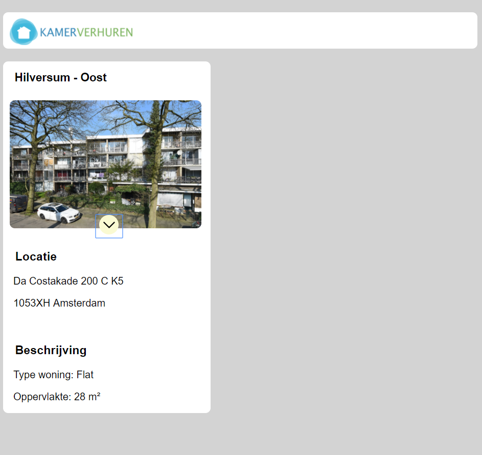

## Versie 1 en versie 2

### Versie 1

Ik ben begonnen met een basis code te schrijven, deze zit in de eerste versie. Hier doet het gewoon wat het moet doen zonder een enkele animatie en al teveel css.

Bij deze versie was het niet heel duidelijk dat de button een button is, ook werden de details erg abrupt uitgeklapt wat er niet heel fijn uit ziet.

### Versie 2

Bij deze versie heb ik een schaduw hover aan de button toegevoegd zodat het duidelijker is dat dit een button is en dat het ook wat moet doen, hoe de details uitgeklapt worden is nog niet veranderd.

>[Versie 1](https://evatissink.github.io/Frontend-voor-designers/opdracht%201/versie%201/)

>[Versie 2](https://evatissink.github.io/Frontend-voor-designers/opdracht%201/versie%202/)

   

## Versie 3

In deze versie heb ik geprobeerd om de details gelijdelijk te laten verschijnen, maar dat is uiteindelijk niet gelukt zoals ik dat wilde omdat ik de details laat zien door middel van een display: block. Om ervoor te zorgen dat de details niet zo abrupt verscheen, heb ik met behulp van keyframes de opacity aangepast zodat de tekst infaded. 

Ook als er op de button geklikt wordt geeft de button feedback dat er geklikt wordt door middel van een translate(y) in de css, dit voelt net iets natuurlijker.

>[Versie 3](https://evatissink.github.io/Frontend-voor-designers/opdracht%201/versie%203/)

 

## Versie 4

Hier heb ik de dropdown (met hulp) werkend gekregen door middel van een for loop. Elk article kan nu zijn eigen details uit laten klappen.

>[Versie 4](https://evatissink.github.io/Frontend-voor-designers/opdracht%201/versie%204/)

