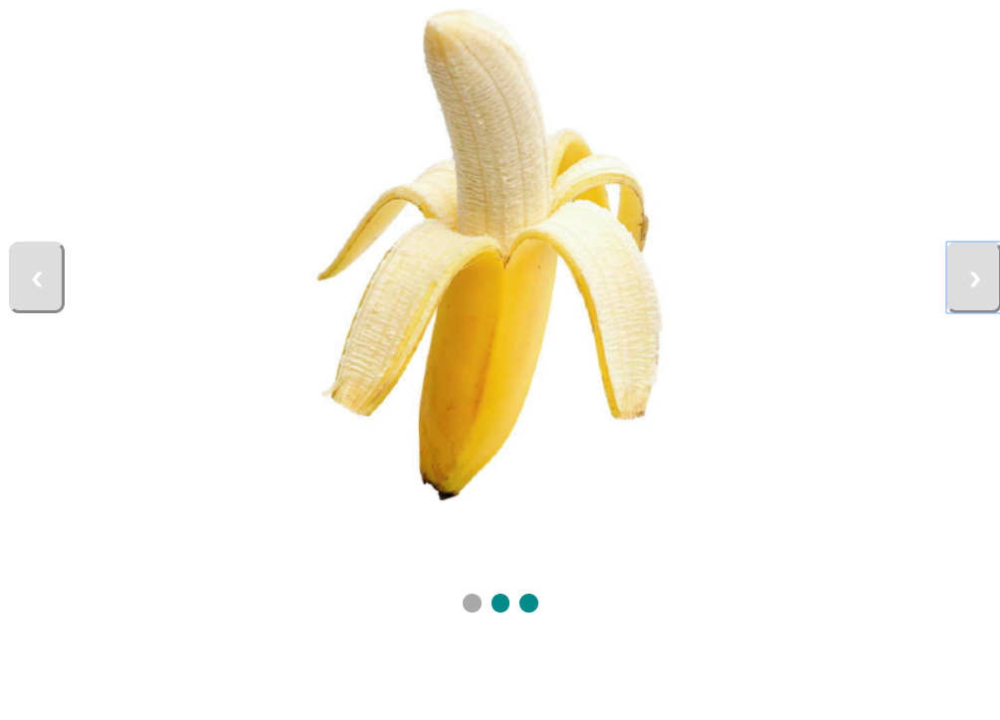
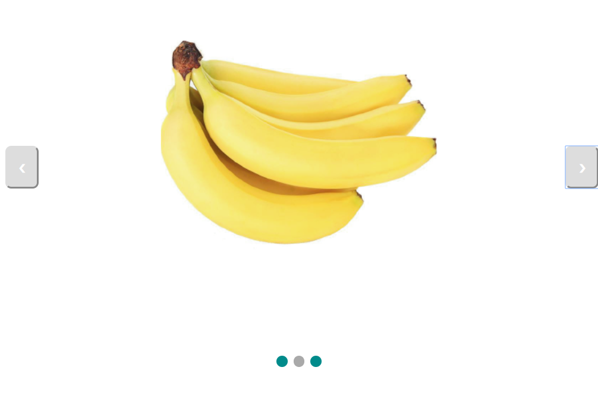
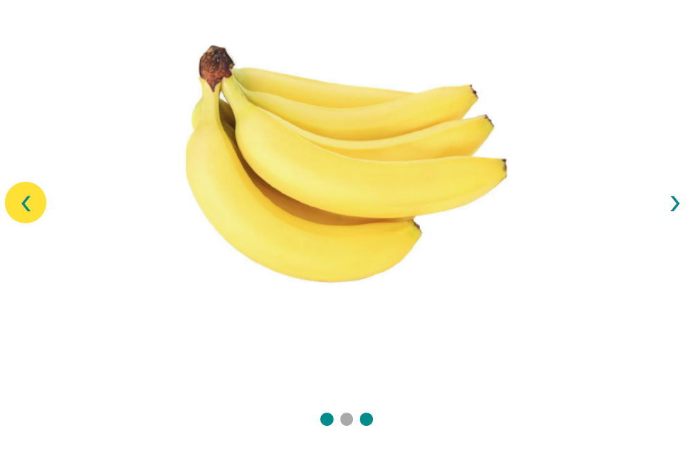

## Versie 1

Dit is de basis code die nog niet helemaal werkt zoals het zou moeten werken. De counter ging van 3 naar 4 en dan naar 2 wat eigenlijk van 3 naar 1 moest gaan. Hierdoor moest je als je aan het einde van het carousel was 1 keer extra klikken om weer de eerste foto te laten verschijnen. De eventlisteners voor de toetsenbord pijltjes werken wel alleen hier moet je ook 1 keer extra klikken.

Ik had de buttons al vormgegeven en een transition aan de foto's toegepast zodat ze vervagend elkaar afwisselen. 

>[Versie 1](https://evatissink.github.io/Frontend-voor-designers/opdracht%202/versie%201/)

## Versie 2

Het carousel is gefixt, de counter = *cijfer* stond niet op de juiste plekken waardoor de counter steeds 1 te ver ging om weer naar het begin of het eind te gaan. Nu kan je ook normaal met de toetsenbord pijltjes navigeren door het carousel.

Mijn volgende stap is om de buttons iets leuker vorm te geven en ook wat te gaan doen met de kleur geel.

>[Versie 2](https://evatissink.github.io/Frontend-voor-designers/opdracht%202/versie%202/)

## Versie 3

Bij deze versie heb ik nog een beetje gespeeld met de vormgeving van de buttons, ik heb ze rond gemaakt en geel om het bananenthema erin te houden. 

>[Versie 3](https://evatissink.github.io/Frontend-voor-designers/opdracht%202/versie%203/)
