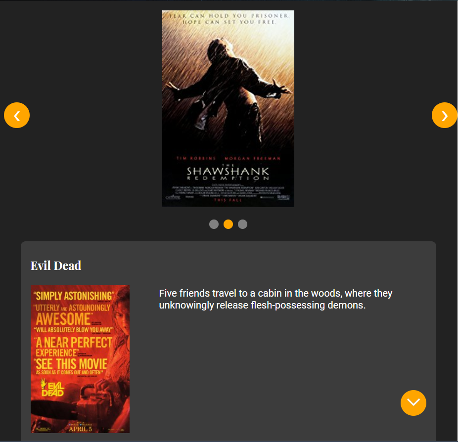
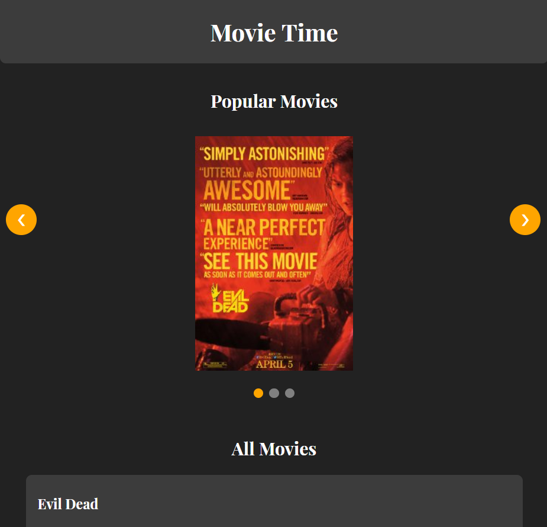
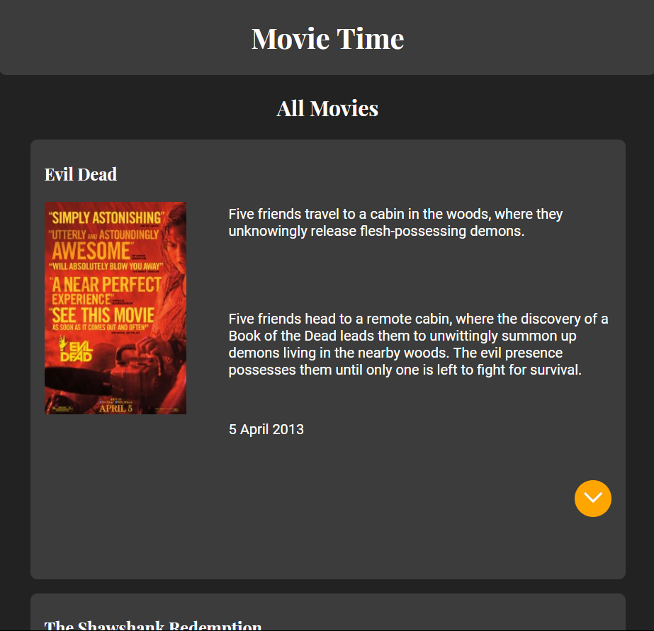
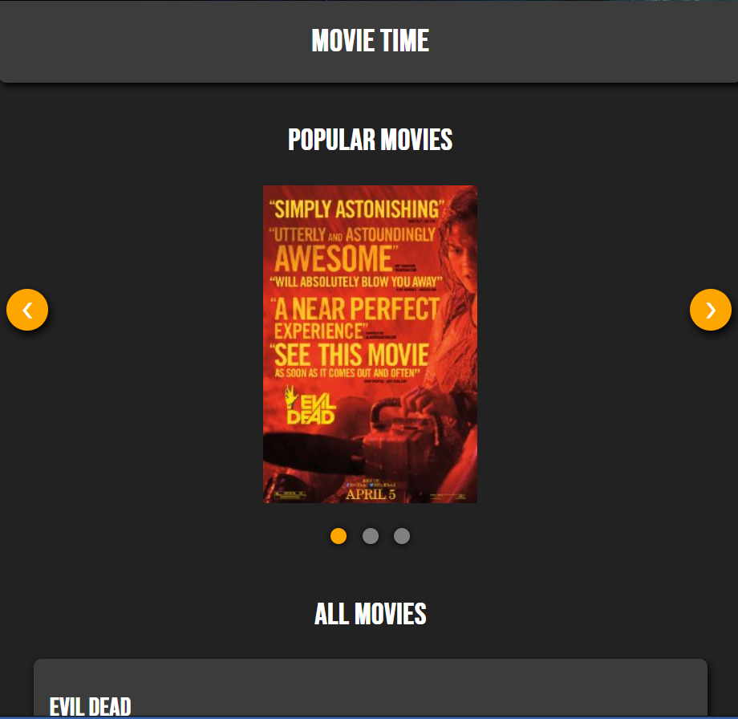
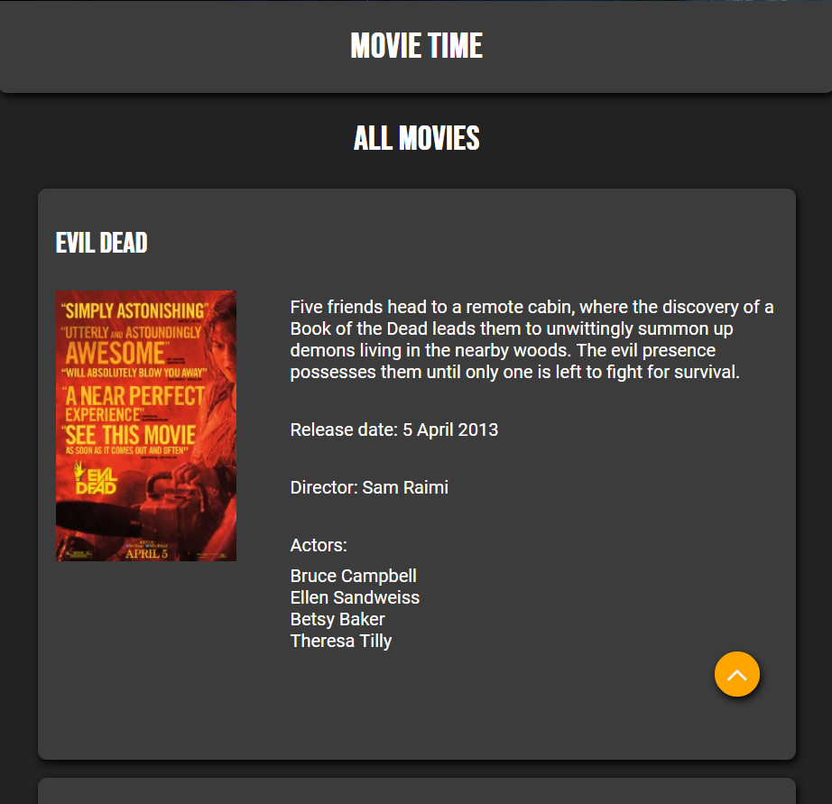

## Versie 1 en versie 2

### Versie 1

Dit is de code waar opdracht 1 werkend verwerkt is, alleen opdracht 2 doet nog niks. De dropdown werkt niet omdat de elementen via js geschreven zijn kunnen ze niet geselecteerd worden. 

### Versie 2

Qua vormgeving is er nog niks veranderd, wel heb ik geprobeerd de dropdown te fixen door middel van een variabele mee te geven aan de for loop die de html schrijft. Deze variabele zou ervoor moeten zorgen dat als de html geschreven is dat dan pas de functie in de for loop van de dropdown aangeroepen mag worden. Echter werkte dit jammer genoeg niet..

### Principes 

*Principe 4: Keep users in control*

Voor deze princicpe heb ik nog niet heel veel gedaan, wat ik zou kunnen toevoegen is een loading state voor als de api wat langer bezig is met het laden van alle informatie. 

*Principe 8: Provide a natural next step*

Hierbij het ik de buttons voor bij het carousel zo ontworpen dat het precies doet wat de gebruiker zal verwachten, de linker gaan een foto terug en de rechter een foto verder. Ook zorgt de progress indicator onder het carousel ervoor dat de gebruiker weet waar hij is met het carousel en weet hoeveel afbeeldingen erin staan.

*Principe 11: Strong visual hierarchies work best*

Alleen bij de articles heb ik wat hierachie toegepast: de titel van de film staat bovenaan in een groter en dikker font dan de informatie die naast de cover van de film staat. Zo is de titel duidelijk zichtbaar en kan de gebruiker de titel meteen herkennen.

>[Versie 1](https://evatissink.github.io/Frontend-voor-designers/opdracht%203/versie%201/)

>[Versie 2](https://evatissink.github.io/Frontend-voor-designers/opdracht%203/versie%202/)

## Versie 3

Bij deze versie heb ik even de dropdown laten zitten, want ik kwam er zelf niet uit. Inplaats daarvan ben ik mij meer gaan focussen op het stijlen van de pagina.

### Principes 

*Principe 11: Strong visual hierarchies work best*

Ik heb een header toegevoegd wat zorgt voor meer hierachie en dat de gebruikers altijd weten op welke site ze zijn. Ook heb ik boven het carousel en de articles headers toegevoegd zodat gebruikers weten waar de naar kijken. Deze headers hebben allemaal een andere font grootte zodat de hierarchie nog sterker wordt.

>[Versie 3](https://evatissink.github.io/Frontend-voor-designers/opdracht%203/versie%203/)

## Versie 4

Ik heb met hulp de dropdown gefixt. In plaats van een variabele moest je in de functie na de (html aanmaak) for loop een functie aanmaken zodat je alle code van de dropdown in een functie met dezelfde naam zet. Zo kan deze functie pas uitgevoerd kan worden nadat de html zeker weten geschreven is.

Wel mag er nog wat meer informatie in de dropdown komen en ervoor zorgen dat die informatie ook begrijpbaar is door middel van bijvoorbeeld headers.

### Principes

*Principe 8: Provide a natural next step*

Nu als je op de knop in een article klikt komt de informatie met een kleine animatie tevoorschijn, wat nog beter zou zijn is als de knop 180 graden omdraait zodat de gebruiker weet dat je zo ook weer de informatie kan inklappen.

>[Versie 4](https://evatissink.github.io/Frontend-voor-designers/opdracht%203/versie%204/)

## Versie 5

Ik heb meer informatie toegevoegd aan de dropdown zodat mensen niet alleen een kort plot, een lang plot en de release date zien. 
Als je op de dropdown knop klikt veranderd het korte plot in een langer plot.

Ook heb ik de progress indicator klikbaar gemaakt zodat gebruikers ook daarmee kunnen browsen, de bolletjes zijn nu ook hoverbaar met een cursor die suggereert dat je erop kan klikken.

Het font van de eerdere versies werkte toch niet zo goed dus ik heb een font gekozen die beter bij een filmwebsite past zodat de site meer een geheel vormt.

### Principles

*Principe 8: Provide a natural next step*

De knop van de dropdown draait als je erop hebt geklikt 180 graden zodat de knop suggereert dat de informatie ook weer ingeklapt kan worden. 

Als je over de progress indicator heen hovert wordt het bolletje een andere kleur en verschijnt er een point cursor zodat de gebruiker weet dat je erop kan klikken.

*Principe 11: Strong visual hierarchies work best*

Bij de extra informatie in de dropdown heb ik voor sommige informatie elementen ervoor gezet wat de gebrioker aan informatie krijgt te zien zodat het overzichtelijk en begrijpbaar blijft.

>[Versie 5](https://evatissink.github.io/Frontend-voor-designers/opdracht%203/versie%205/)

## 
Omdat GitHub geen JSON files met http ondersteund, hier nogmaals de definitieve versie werkend mocht de github versie niet werken:

>[Versie 5](http://evatissink.nl/)
